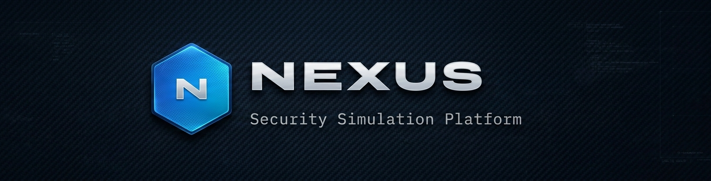

# 🏢 NEXUS — TechSolutions Security Simulator


<p align="center">
  
  
  
  
</p>

---


---

## ✨ Key Features

### 🎮 **5 Interactive Security Modules**

| Module | Focus Area | Description |
|--------|------------|-------------|
| **01 — MFA Attack Simulator** | Authentication Security | Simulate real-world credential attacks and observe how different MFA methods block or allow each attempt |
| **02 — Resource Access Control** | Policy Design | Assign correct MFA levels to 8 corporate systems and get scored against assessment recommendations |
| **03 — Physical Security Audit** | Facility Security | Interactive floor plan with clickable zones revealing vulnerabilities, risks, and remediation costs |
| **04 — Visitor Management** | Physical Access Control | Step-by-step visitor check-in simulation with security decisions at each gate |
| **05 — MFA Rollout Dashboard** | Implementation Planning | Track 5-phase MFA rollout with progress metrics, KPIs, and detailed phase information |

---

## 📊 **Module 01: MFA Attack Simulator**

### **Attack Types** ⚔️
| Attack | Description |
|--------|-------------|
| **Phishing** | Credential theft via deceptive email and fake login portals |
| **Brute Force** | Automated password guessing with tools like Hydra |
| **Credential Stuffing** | Exploiting reused passwords from external data breaches |
| **Malicious Insider** | Authorized credentials used with hostile intent after termination |
| **Anomalous Context** | Impossible travel scenarios (3AM login from foreign IP) |

### **MFA Methods** 🔐
| Method | Description | Phishing Resistance |
|--------|-------------|---------------------|
| **No MFA** | Username + Password only | ❌ None |
| **TOTP** | Time-based One-Time Password (Authenticator App) | ⚠️ Partial (vulnerable to real-time relay) |
| **FIDO2** | Hardware Security Key | ✅ High (domain-bound) |
| **Biometric** | Fingerprint / Face Recognition | ✅ High (device-bound) |

### **Attack Results Matrix**

| Attack | No MFA | TOTP | FIDO2 | Biometric |
|--------|--------|------|-------|-----------|
| Phishing | ❌ Breach | ⚠️ Partial | ✅ Blocked | ✅ Blocked |
| Brute Force | ❌ Breach | ✅ Blocked | ✅ Blocked | ✅ Blocked |
| Cred Stuffing | ❌ Breach | ✅ Blocked | ✅ Blocked | ✅ Blocked |
| Insider | ❌ Breach | ❌ Breach | ❌ Breach | ✅ Blocked* |
| Anomalous Context | ❌ Breach | ⚠️ Partial | ⚠️ Partial | ✅ Blocked |

*\*Requires HR/IT deprovisioning integration*

### **Features**
- **Live attack simulation** with step-by-step terminal output
- **Color-coded results** (✅ Blocked / ⚠️ Partial / ❌ Breached)
- **Attack history log** tracking all simulations
- **Statistics counter** for blocked vs breached attempts
- **Detailed outcome descriptions** explaining *why* each result occurs


---

## 🔒 **Module 02: Resource Access Control**

### **8 Corporate Systems to Assess**

| System | Sensitivity | Current State | Correct MFA Level |
|--------|-------------|---------------|-------------------|
| **Corporate Email** | 🔴 High | Username + Password | Required |
| **Internal Databases** | 🔴 High | Username + Password | Required |
| **Cloud Storage** | 🔴 High | Username + Password | Required |
| **HR Systems** | 🔴 High | Username + Password | Required |
| **CRM Software** | 🔴 High | Username + Password | Required |
| **Project Mgmt Tools** | 🟡 Medium | Username + Password | Required |
| **Dev Environments** | 🔴 High | SSH Keys (unmanaged) | Required |
| **Intranet & Wiki** | 🔵 Low-Med | Username + Password | Recommended |

### **Assessment Features**
- **Drop-down selectors** for each system (Not Needed / Recommended / Required)
- **Real-time feedback** showing correct/incorrect assignments
- **Color-coded cards** based on sensitivity level
- **Scoring system** with percentage calculation
- **Performance tiers**: EXPERT (100%), PROFICIENT (75%+), DEVELOPING (50%+), NEEDS REVIEW (<50%)
- **Detailed explanation** for each score result


---

## 🏢 **Module 03: Physical Security Audit**

### **7 Interactive Zones**

| Zone | Priority | Vulnerability | Risk |
|------|----------|---------------|------|
| **Server Room** | 🔴 Critical | Janitorial staff have access alongside IT | Unauthorized access, device tampering |
| **Back Entrance** | 🔴 High | Only "Authorized Personnel Only" sign | Tailgating, no audit trail |
| **Reception & Lobby** | 🟡 High | Visitor badges without photo capture | Fake identities, no post-incident evidence |
| **Breakrooms** | 🟡 High | No access control or surveillance | Attackers hide after hours |
| **Parking Lot** | 🔵 Medium | Paper stickers — no gate control | Unauthorized vehicles, copied stickers |
| **Meeting Rooms** | 🔵 Medium | No access control integration | Unauthorized bookings, AV theft |
| **Workspace** | 🟢 Low | Clean desk policy not enforced | Shoulder surfing, screen exposure |

### **Features**
- **Interactive floor plan canvas** with clickable zones
- **Priority color-coding**: Critical (🔴 Red), High (🟡 Amber), Medium (🔵 Blue), Low (🟢 Green)
- **Zone detail panel** showing:
  - Vulnerability description
  - Potential risk assessment
  - Remediation steps
  - Estimated cost ($ to $$$$)
- **Quick navigation** via vulnerability index list


---

## 👥 **Module 04: Visitor Management**

### **4 Visitor Scenarios**

| Visitor | Company | Type | Risk Level | Pre-Registered |
|---------|---------|------|------------|----------------|
| **James Whitfield** | CloudVault Partners | Client meeting | 🟢 Low | ✓ Yes |
| **Sofia Reyes** | Unknown (Walk-in) | No appointment | 🟡 Medium | ✗ No |
| **Marcus Chen** | ClearOps Maintenance | Server room maintenance | 🔴 High | ✓ Yes |
| **Amanda Torres** | HR Software Co. | Software demo | 🟢 Low | ✓ Yes |

### **8-Step Check-In Process**

```
Arrival → ID Check → Watchlist → Photo → Host Alert → NDA → Badge → Escort
```

### **Security Decisions at Each Gate**
- **ID Check**: Verify government ID, scan barcode, reject invalid IDs
- **Watchlist**: Automated checks against OFAC, FBI, internal banned lists
- **Host Alert**: Push notification to host, confirm escort
- **NDA**: Digital signature with acknowledgment of security policies
- **Badge**: Color-coded based on risk level (WHITE / ORANGE for contractors)

### **Features**
- **Visual step tracker** showing current position in flow
- **Real-time visitor log** with timestamps
- **Risk-based badge types** and access restrictions
- **Rejection handling** with incident logging
- **Complete audit trail** for all visitor interactions


---

## 📈 **Module 05: MFA Rollout Dashboard**

### **5-Phase Implementation Plan**

| Phase | Timeline | Users | Systems | MFA Method |
|-------|----------|-------|---------|------------|
| **1: Pilot** | Week 1-2 | 20 | Email, VPN, Admin | TOTP |
| **2: Technical Staff** | Week 3-4 | 50 | Email, Dev, VPN | FIDO2 + TOTP |
| **3: All Employees** | Week 5-8 | 200 | Email, Cloud, Project Tools | TOTP |
| **4: High-Sensitivity** | Week 9-10 | 60 | DB, HR, CRM | FIDO2 (required) |
| **5: Completion & Audit** | Week 11-12 | 220 | All systems | All methods |

### **Key Performance Indicators**
- **Users Enrolled**: 220 total target
- **Enrollment Rate**: Progress toward 98% goal
- **Phases Complete**: 5-phase tracker
- **Support Tickets**: Real-time estimate based on enrollment

### **Features**
- **Expandable phase cards** with detailed information
- **Progress bars** for each phase
- **Weekly advancement simulation** with "Advance Phase" button
- **Color-coded status** (🟢 Completed / 🔵 Active / ⚪ Not Started)
- **Detailed phase information** including:
  - Systems covered
  - MFA methods deployed
  - Success criteria
  - Implementation notes


---

## 🎨 **Design & Aesthetics**

### **Corporate Security Dashboard** 🏢
- **Dark blue background** (`#080d16`) — professional SOC aesthetic
- **Tech blue primary** (`#2d8cf0`) for interactive elements
- **Cyan accents** (`#00c8e8`) for highlights and progress
- **Red alerts** (`#e8404a`) for critical issues
- **Amber warnings** (`#f5a623`) for medium risk
- **Green success** (`#1fd0a0`) for completed items

### **Typography** ✍️
- **Syne** — Bold headers and hexagon logo
- **JetBrains Mono** — Terminal output, stats, code elements
- **Barlow** — Body text for readability

### **Visual Elements**
- **Hexagon logo** with pulsing glow animation
- **Grid background** for technical depth
- **Status pills** with live indicators
- **Animated progress bars**
- **Color-coded priority badges**
- **Terminal-style output** with typing animation

---

## 🛠️ **Technical Implementation**

### **Architecture**
```
┌─────────────────────────────────────┐
│         NEXUS Security Simulator     │
├─────────────────────────────────────┤
│                                     │
│  ┌─────────────────────────────┐   │
│  │      Module 1: MFA Attack    │   │
│  │  • 5 attack types            │   │
│  │  • 4 MFA methods             │   │
│  │  • Attack history            │   │
│  │  • Result matrix             │   │
│  └─────────────────────────────┘   │
│                                     │
│  ┌─────────────────────────────┐   │
│  │      Module 2: Resources     │   │
│  │  • 8 systems                 │   │
│  │  • Scoring engine            │   │
│  │  • Performance tiers         │   │
│  └─────────────────────────────┘   │
│                                     │
│  ┌─────────────────────────────┐   │
│  │      Module 3: Physical      │   │
│  │  • Interactive canvas        │   │
│  │  • 7 zones with click        │   │
│  │  • Vulnerability details     │   │
│  └─────────────────────────────┘   │
│                                     │
│  ┌─────────────────────────────┐   │
│  │      Module 4: Visitor       │   │
│  │  • 4 visitor scenarios       │   │
│  │  • 8-step workflow           │   │
│  │  • Decision points           │   │
│  └─────────────────────────────┘   │
│                                     │
│  ┌─────────────────────────────┐   │
│  │      Module 5: Rollout       │   │
│  │  • 5-phase timeline          │   │
│  │  • Progress tracking         │   │
│  │  • KPI dashboard             │   │
│  └─────────────────────────────┘   │
└─────────────────────────────────────┘
```

### **Key Functions**

```javascript
// Module 1: MFA Attack Simulator
runAtk()              // Execute selected attack with chosen MFA
clrTerm()             // Clear terminal output

// Module 2: Resource Access
scoreRes()            // Score user selections against correct answers
resetRes()            // Reset all selections

// Module 3: Physical Security
drawFP()              // Draw floor plan canvas
fpClick()             // Handle zone click events
showZone(z)           // Display zone details

// Module 4: Visitor Management
startVis(i)           // Start check-in for selected visitor
nxtVS()               // Advance to next step
rejVis(r)             // Reject visitor with reason
cmpVis()              // Complete check-in

// Module 5: MFA Rollout
advRol()              // Advance rollout phase
tglPh(i)              // Toggle phase details
updKPIs()             // Update KPI dashboard
```

---

## 📊 **Content Breakdown**

| Module | Items | Interactions | Outputs |
|--------|-------|--------------|---------|
| **MFA Attack** | 5 attacks × 4 MFA | 20 scenarios | Terminal output, result box, history log |
| **Resources** | 8 systems | 24 options | Score, feedback, performance tier |
| **Physical** | 7 zones | 7 clickable areas | Vulnerability details, remediation |
| **Visitor** | 4 visitors × 8 steps | 32 decision points | Audit log, badge type, incident records |
| **Rollout** | 5 phases | Progressive timeline | KPIs, phase details, progress bars |

---

## 🌐 **Browser Compatibility**

| Browser | Support |
|---------|---------|
| Chrome | ✅ Full support |
| Firefox | ✅ Full support |
| Safari | ✅ Full support |
| Edge | ✅ Full support |
| Opera | ✅ Full support |
| Mobile Chrome | ⚠️ Limited (canvas interactions best on desktop) |
| Mobile Safari | ⚠️ Limited (canvas interactions best on desktop) |

---

## 🚦 **Performance**

- **Load Time**: < 1.5 seconds (zero external dependencies)
- **Memory Usage**: < 40 MB
- **CPU Usage**: Minimal (event-driven)
- **Network**: Zero requests after initial load

---

## 🛡️ **Security Notes**

NEXUS is a **completely safe** educational simulation:
- ✅ No actual security testing performed
- ✅ All simulations run in browser memory
- ✅ No data collection or tracking
- ✅ No external dependencies
- ✅ Pure HTML/CSS/JavaScript
- ✅ Educational purposes only — learn security assessment methodology

---

## 📝 **License**

MIT License — see LICENSE file for details.

---

## 🙏 **Acknowledgments**

- **TechSolutions Inc.** — Fictional company based on real-world security assessment patterns
- **NIST 800-63B** — Digital identity guidelines for MFA
- **MITRE ATT&CK** — Attack methodology reference
- **OWASP** — Authentication best practices
- **ISO 27001** — Information security management framework

---

## 📧 **Contact**

- **GitHub Issues**: [Create an issue](https://github.com/Willie-Conway/NEXUS/issues)
- **Website**: https://willie-conway.github.io/NEXUS/

---

## 🏁 **Future Enhancements**

- [ ] Add more attack types (SIM swapping, MFA fatigue)
- [ ] Include compliance mapping (NIST, ISO, PCI)
- [ ] Add budget calculator for remediation costs
- [ ] Export assessment reports as PDF
- [ ] Multi-language support
- [ ] User authentication simulation
- [ ] Incident response timeline simulator

---

<p align="center">
  <strong>🏢 NEXUS — Security Simulation Platform for IT Professionals 🏢</strong>
</p>


---

*Last updated: March 2026*
